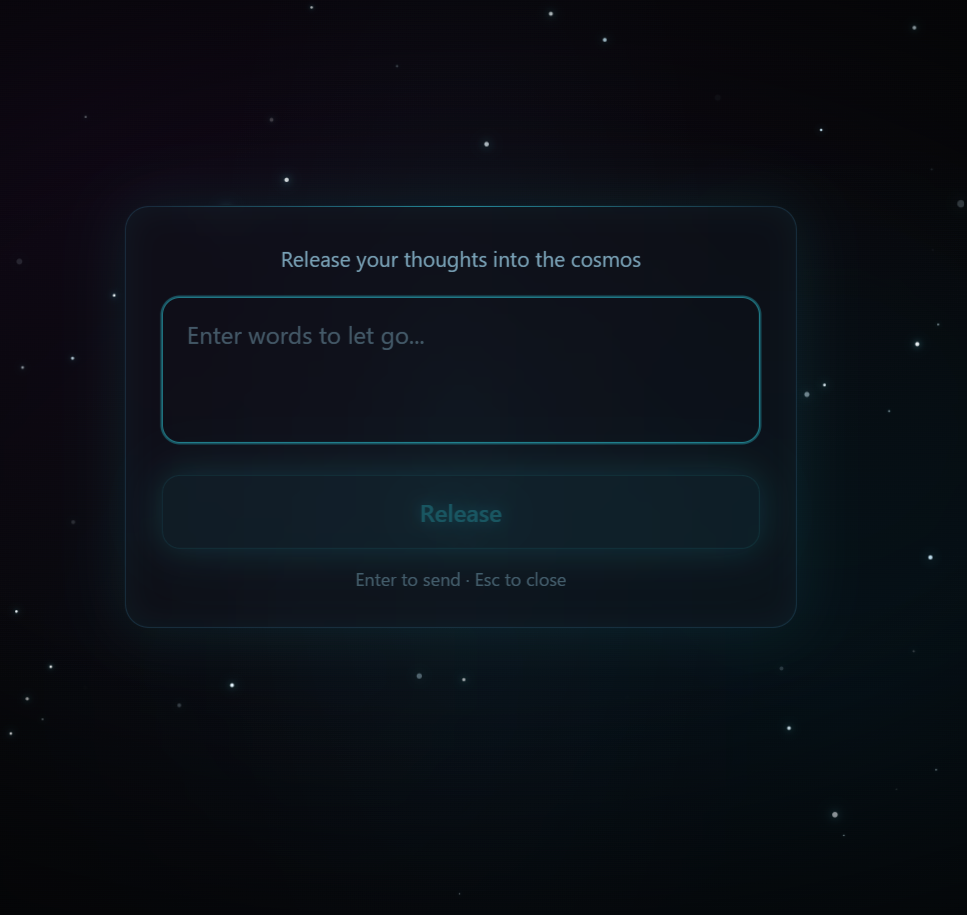

🌠 Release into Space

 自由に言葉を書いて、宇宙に放つ

---

言えない言葉や想いを書いて、リリースしてください。  
誰にも見られません。言葉は保存されません。  
安心して正直な想いを書いて、放ってください。  
**書いてクリックするだけ。**

---

## ✨ 体験する

**👉 [30秒体験はこちら](https://release-into-space.vercel.app)**

---

このアプリについて

- 入力した言葉は**どこにも保存されません**
- **誰にも見られません**
- 文字が宇宙の奥へ消えていく、ただそれだけ
- 言えなかった言葉、抱えていた想い、そっと手放してください

---

 技術スタック

- [React](https://react.dev/) + [TypeScript](https://www.typescriptlang.org/)
- [Framer Motion](https://www.framer.com/motion/) — 文字が宇宙へ飛ぶアニメーション
- [Tailwind CSS](https://tailwindcss.com/)
- [Vite](https://vitejs.dev/)
- Deploy: [Vercel](https://vercel.com/)

---

## 📄 License

MIT © soraniikou
